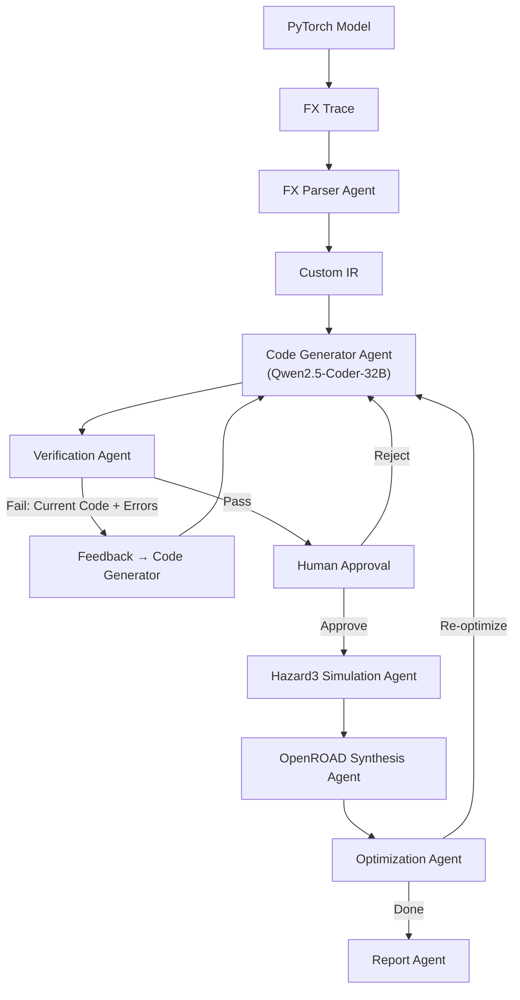
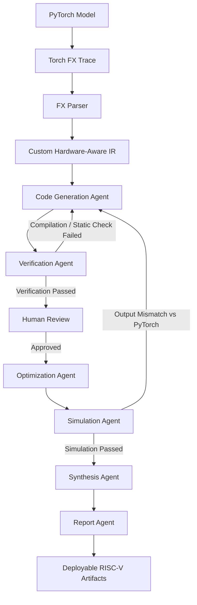

# Agentic RISC-V Compiler & Pipeline — Unified Implementation Plan

A LangGraph-based multi-agent system that converts PyTorch models into optimized RISC-V C code, simulates on Hazard3, and synthesizes with OpenROAD — forming a **closed-loop hardware-aware compiler**.

This unified plan integrates the original design with the enhancements made to resolve weight serialization, deterministic header loading, iterative feedback loops, two-phase LLM generation, and robust state persistence.

---

## Architecture Overview



---





## User Review Required

> [!IMPORTANT]
> **LLM Backend**: The pipeline uses Qwen2.5-Coder-32B via an OpenAI-compatible API endpoint (e.g., `vLLM`, `Ollama`, `text-generation-inference`, or any provider). You'll need to set `OPENAI_API_BASE` and `OPENAI_API_KEY` environment variables.

> [!IMPORTANT]
> **External Toolchains**: The project wraps `riscv32-unknown-elf-gcc`, Hazard3 simulator, Yosys, and OpenROAD via `subprocess`. These must be installed on the host (or WSL). The code gracefully degrades with mock/stub outputs if tools are missing, making the pipeline **demo-able** even without them installed.

> [!IMPORTANT]
> **Weight Loading Options**: By default, weights are generated in **embedded mode** (baked directly into headers as C array static initializers at full `f32` precision) for bare-metal compatability. An optional **binary mode** generates a `weights.bin` file along with loader helper code for hosted environments.

> [!WARNING]
> **Scope for Hackathon**: The optimization agent (closed-loop re-optimization based on power/area/cycles) is optional and can be toggled. For demos, running it with 1 iteration is recommended.

---

## Open Questions & Resolutions

> [!NOTE]
> **Q1: Qwen API Endpoint**
> *Resolution*: Configured using LangChain's `ChatOpenAI` wrapper pointing to a configurable base URL, facilitating local endpoints (Ollama/vLLM) or remote providers.

> [!NOTE]
> **Q2: Target RISC-V ISA**
> *Resolution*: Targets `rv32im` (integer + multiply) for broad simplicity, with options for target optimizations.

> [!NOTE]
> **Q3: Demo Model**
> *Resolution*: A simple model is included in `examples/demo_model.py` (Conv -> ReLU -> AdaptiveAvgPool2d -> Flatten -> Linear) to run end-to-end compilation quickly.

> [!NOTE]
> **Q4: Bare-Metal vs. Hosted Weight Mode**
> *Resolution*: Default is **embedded mode** (bare-metal compatible with weight literals in C array definitions). **Binary mode** is provided as a CLI option (`--weight-mode binary`), compiling a binary loader that opens `weights.bin` on a target with a filesystem.

> [!NOTE]
> **Q5: Precision Configurations**
> *Resolution*: Default precision is full precision `f32`. Optional precisions are supported via CLI (`--precision`), including `f16`, `bf16`, and `mxfp8`, making the pipeline adaptable to recent LLM quantization formats.

---

## Custom IR Design

The custom IR bridges PyTorch FX semantics and C code generation. It is a dataflow graph of hardware-friendly nodes.

### IR Node Types

| IR Op | Description | Maps From (FX) | C Code Pattern |
|-------|-------------|-----------------|----------------|
| `TENSOR_INPUT` | Input placeholder | `placeholder` | `float* input_0` |
| `CONV2D` | 2D convolution | `nn.Conv2d` | Nested loop with MAC |
| `LINEAR` | Matrix multiply + bias | `nn.Linear` | GEMM loop |
| `RELU` | Element-wise max(0,x) | `F.relu` / `nn.ReLU` | `x > 0 ? x : 0` |
| `BATCHNORM` | Batch normalization | `nn.BatchNorm2d` | Scale + shift |
| `MAXPOOL2D` | Max pooling | `nn.MaxPool2d` | Sliding window max |
| `AVGPOOL2D` | Average pooling | `nn.AdaptiveAvgPool2d` | Sliding window avg |
| `ADD` | Element-wise add | `operator.add` | `a[i] + b[i]` |
| `MUL` | Element-wise multiply | `operator.mul` | `a[i] * b[i]` |
| `FLATTEN` | Reshape to 1D | `torch.flatten` | Index remapping |
| `SOFTMAX` | Softmax | `F.softmax` | exp + normalize |
| `TENSOR_OUTPUT` | Output | `output` | `return` |

### IR Data Structure (Python dataclasses)

```python
@dataclass
class IRNode:
    id: str              # Unique node name
    op: str              # One of the IR Op types above
    inputs: List[str]    # IDs of input nodes
    params: Dict         # Op-specific: kernel_size, stride, padding, etc.
    shape: Tuple         # Output tensor shape
    dtype: str           # "float32", "int8", etc.
    weight_key: str      # Key into weights dict (if applicable)

@dataclass  
class IRGraph:
    nodes: List[IRNode]
    input_shapes: Dict[str, Tuple]
    weight_metadata: Dict[str, Dict]  # name → {shape, dtype, nbytes}
```

---

## Project Structure & Component Specifications

### Project Structure

```text
agentic-riscv/
├── main.py                    # Entry point with CLI args for precision & weight-mode
├── graph.py                   # LangGraph workflow definition
├── state.py                   # Shared AgentState TypedDict state
├── ir.py                      # Custom IR dataclasses
├── agents/
│   ├── __init__.py
│   ├── fx_parser.py           # FX → Custom IR + npz serialization
│   ├── codegen_contract.py    # [NEW] Standardizes required helper signatures dynamically
│   ├── code_generator.py      # IR → C code (model.h / model.c) with deterministic weights header, repair loops
│   ├── verifier.py            # Syntax & structural validation (detects placeholders/errors)
│   ├── human_review.py        # Human-in-the-loop pause
│   ├── simulator.py           # Hazard3 simulation wrapper
│   ├── synthesis.py           # OpenROAD synthesis wrapper
│   ├── optimizer.py           # Optimization suggestions (LLM)
│   └── report.py              # Final report generator
├── prompts/
│   ├── codegen.txt            # Code generator system prompt
│   └── optimizer.txt          # Optimization system prompt
├── tools/
│   ├── __init__.py
│   ├── compile.py             # RISC-V GCC cross-compilation
│   ├── export_weights.py      # NPZ → Bin & Manifest + C header/loader generator
│   ├── hazard3.py             # Hazard3 simulator wrapper
│   └── openroad.py            # OpenROAD flow wrapper
├── examples/
│   └── demo_model.py          # Simple PyTorch model for testing
├── tests/                     # [NEW] Unit tests for LLM generation components
├── output/                    # Generated artifacts (gitignored)
├── requirements.txt
└── README.md
```

### Component Specifications

#### [state.py](file:///c:/Coding%20projects/agentic-riscv/state.py)
Defines the LangGraph shared `TypedDict` state:
- `model_name`, `fx_graph_str`, `ir_graph` (serialized IRGraph)
- `weights_metadata`, `weights_path`
- **Weight configuration updates**:
  - `weights_bin_path`: Path to the exported `weights.bin` binary file
  - `weights_manifest`: Manifest dictionary mapping parameter names to details (`c_name`, `offset`, `size_bytes`, `numel`, `shape`, `c_type`, `precision`)
  - `weight_precision`: Supported precision mode (`f32`, `f16`, `bf16`, `mxfp8`)
  - `weight_mode`: Storage strategy (`embedded` or `binary`)
- **Generation Output**: `generated_code` (model.c content), `generated_header` (weights.h content), `generated_model_header` (model.h content)
- `verification_result`, `verification_attempts`, `verification_exhausted` (boolean for routing)
- `human_approved` (bool)
- `simulation_result`, `synthesis_result`, `optimization_suggestions`, `optimization_iteration`
- `final_report`, `error`

#### [tools/export_weights.py](file:///c:/Coding%20projects/agentic-riscv/tools/export_weights.py)
A pure-Python utility to process model weights:
- Exports weights from `weights.npz` to a flat binary `weights.bin` supporting customizable precision.
- Generates `weights_manifest.json` mapping parameter details.
- Generates `weights.h` deterministically depending on selected mode.
- Sanitizes float values (e.g. `inf` → `FLT_MAX`, `nan` → `0.0f`) before emitting C literals to prevent compilation errors.

#### [agents/fx_parser.py](file:///c:/Coding%20projects/agentic-riscv/agents/fx_parser.py)
Python analysis agent:
- Traces model with `torch.fx.symbolic_trace`.
- Maps FX ops to Custom `IRNode` entities.
- Extracts shape information from tensor metadata.
- Saves model weights to `output/weights.npz`.
- Invokes `export_weights` to generate `weights.bin`, `weights.h` and populates weight manifest fields.

#### [agents/code_generator.py](file:///c:/Coding%20projects/agentic-riscv/agents/code_generator.py)
LLM-powered code generation agent using **Two-Phase Generation**:
- **Phase 1 (Contract Definition):** Generates `model.h` containing includes (`#include "weights.h"`), tensor contracts, and function prototypes required by `codegen_contract.py`.
- **Phase 2 (Implementation):** Generates `model.c` that implements the logic.
- **File-Backed Persistence:** Saves outputs directly to `output/_latest_model.c` to prevent state loss during retries.
- **Iterative Repair Mode:** Reads from `output/_latest_model.c` and targets specific compiler errors reported by the verifier.

#### [agents/verifier.py](file:///c:/Coding%20projects/agentic-riscv/agents/verifier.py)
Verification agent:
- Compiles with cross-compiler `riscv32-unknown-elf-gcc -fsyntax-only`.
- Checks that `model.c` includes `model.h` and adheres to `codegen_contract.py` compliance.
- Parses output for missing components, shape mismatches, and placeholder implementations.

#### [graph.py](file:///c:/Coding%20projects/agentic-riscv/graph.py)
LangGraph workflow definition:
- Routes between parsing, generation, verification, simulation, and synthesis.
- After 5 verification failures, routes to `human_review` instead of aborting.

#### [main.py](file:///c:/Coding%20projects/agentic-riscv/main.py)
Entry point:
- Supports `--start-from` argument (e.g., `verify`, `simulate`) to bypass code generation and load existing state directly from `output/` artifacts.
- Extracts `weights_metadata` and IR metrics (`total_params`, `model_memory_bytes`) robustly to prevent empty reports when skipping `parse_fx`.

---

## Recent Pipeline Enhancements (Issues 1-6)

### Issue 1: `generated_code` Is Empty on Retries
- **Fix:** File-backed code persistence. Instead of relying on LangGraph state alone, persist the generated code to a temp file (`output/_latest_model.c`) and read it back on retries.

### Issue 2: Two-Phase LLM Code Generation & Codegen Contracts
- **Fix:** Two-phase generation. LLM Call 1 generates `model.h` (includes, tensor contracts, function prototypes provided via `codegen_contract.py`). LLM Call 2 receives the exact text of `model.h` and generates `model.c`.

### Issue 3: Increase `max_tokens` to 200K for MI300x GPU
- **Fix:** Made `max_tokens` configurable in `code_generator.py`, reading from `VLLM_MAX_TOKENS` environment variable (default 200,000).

### Issue 4: Fix `inff` Undeclared Error in `weights.h`
- **Fix:** Sanitized float values in `export_weights.py` before emitting C literals (`inf` → `3.402823466e+38f`, `-inf` → `-3.402823466e+38f`, `nan` → `0.0f`).

### Issue 5: Route to Human Review After 5 Verification Failures
- **Fix:** After 5 compilation failures, LangGraph routes to `human_review` instead of `report`. Users can edit files manually and choose to (e)dit and re-verify, (r)etry generation, (a)pprove and proceed, or (q)uit.

### Issue 6: Allow Starting the Pipeline from a Specific Agent
- **Fix:** Implemented a `--start-from` CLI argument in `main.py` that populates `AgentState` by loading previously generated files from the `output/` directory, computing metadata directly from the `ir_graph.json` or fallback PyTorch model.

### Issue 7: `TypeError: Type is not msgpack serializable: TinyLlamaDemo`
- **Root Cause:** `AgentState` contained live PyTorch objects (`model: nn.Module`, `fx_graph: GraphModule`, `sample_input: Tensor`) that LangGraph's `MemorySaver` tried to checkpoint via msgpack when hitting `interrupt_before=["human_review"]`.
- **Fix:** `fx_parser.py` now returns `"model": None, "fx_graph": None, "sample_input": None` in its output dict, clearing these non-serializable objects from state after they've been consumed. `main.py` also conditionally adds these objects to `initial_state` only when `start_from == "parse_fx"`.

### Issue 8: `agents/verifier.py` Accidentally Overwritten with Prompt Text
- **Root Cause:** The file `agents/verifier.py` was accidentally replaced with the contents of `prompts/codegen.txt` (the LLM system prompt), destroying the Python verification code.
- **Fix:** Restored `verifier.py` with proper implementation of `verify_code()`, `_check_model_header()`, and `_check_required_helper_definitions()` functions.

### Issue 9: Cross-Compilation `wfi` Error and Simulation/Synthesis Fallback
- **Root Cause:** Host `gcc` (used when no RISC-V cross-compiler is available) doesn't understand the `wfi` RISC-V instruction in the startup code. Additionally, when cross-compilation failed, the simulator returned a hard failure that blocked the pipeline.
- **Fix:**
  - Added `#ifdef __riscv` guards around `wfi` instruction in `tools/compile.py` startup code — host gcc gets a plain spin loop instead.
  - Modified `agents/simulator.py` to automatically fall back to mock simulation when cross-compilation fails, logging a clear warning rather than halting the pipeline.
  - Synthesis already had proper fallback via `MOCK_SYNTHESIS=true` (default).

---

## Verification Plan

### Automated Tests
1. **Module Structure Verification**:
   ```bash
   python -c "from state import AgentState; print('State OK')"
   python -c "from ir import IRGraph, IRNode; print('IR OK')"
   python -c "from graph import build_graph; print('Graph OK')"
   ```
2. **Deterministic Weight Export and Parsing Verification**:
   ```bash
   python -c "
   from examples.demo_model import DemoModel
   from agents.fx_parser import parse_fx_graph
   import torch.fx
   model = DemoModel()
   traced = torch.fx.symbolic_trace(model)
   result = parse_fx_graph({'fx_graph': traced, 'model': model})
   print('IR nodes parsed:', len(result['ir_graph']['nodes']))
   "
   ```
3. **End-to-End Pipeline Check**:
   - Run pipeline end-to-end with `--demo`.
   - Verify `output/_latest_model.c` is created and persists across retries.
   - Verify `output/model.h` is generated and included in `model.c`.
   - Verify no `inff` or `nanf` in `output/weights.h`.
4. **Retry and Route Testing**:
   - Simulate a verification failure and confirm repair mode reads code from `_latest_model.c`.
   - Ensure after 5 failures, pipeline routes to human review.
5. **State Recovery Check**:
   - Test `--start-from verify` after manually editing `output/model.c` to ensure state is correctly restored.

### Manual Verification
- Check LLM prompts in logs to confirm `model.h` content and `codegen_contract` signatures are included in the second LLM call.
- Verify that `--start-from verify` correctly populates reporting metrics (no empty dictionaries/tables).
- Verify that the human review interrupt shows the correct options after verification exhaustion.
