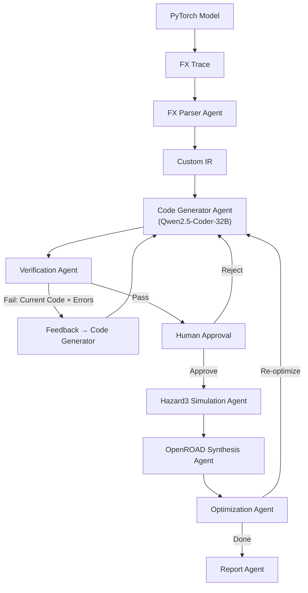

# Agentic RISC-V Compiler & Pipeline — Unified Implementation Plan

A LangGraph-based multi-agent system that converts PyTorch models into optimized RISC-V C code, simulates on Hazard3, and synthesizes with OpenROAD — forming a **closed-loop hardware-aware compiler**.

This unified plan integrates the original design with the enhancements made to resolve weight serialization, deterministic header loading, and iterative feedback loops.

---

## Architecture Overview



---

## User Review Required

> [!IMPORTANT]
> **LLM Backend**: The pipeline uses Qwen2.5-Coder-32B via an OpenAI-compatible API endpoint (e.g., `vLLM`, `Ollama`, `text-generation-inference`, or any provider). You'll need to set `OPENAI_API_BASE` and `OPENAI_API_KEY` environment variables.

> [!IMPORTANT]
> **External Toolchains**: The project wraps `riscv32-unknown-elf-gcc`, Hazard3 simulator, Yosys, and OpenROAD via `subprocess`. These must be installed on the host (or WSL). The code gracefully degrades with mock/stub outputs if tools are missing, making the pipeline **demo-able** even without them installed.

> [!IMPORTANT]
> **Weight Loading Options**: By default, weights are generated in **embedded mode** (baked directly into headers as C array static initializers at full `f32` precision) for bare-metal compatability. An optional **binary mode** generates a `weights.bin` file along with loader helper code for hosted environments.

> [!WARNING]
> **Scope for Hackathon**: The optimization agent (closed-loop re-optimization based on power/area/cycles) is optional and can be toggled. For demos, running it with 1 iteration is recommended.

---

## Open Questions & Resolutions

> [!NOTE]
> **Q1: Qwen API Endpoint**
> *Resolution*: Configured using LangChain's `ChatOpenAI` wrapper pointing to a configurable base URL, facilitating local endpoints (Ollama/vLLM) or remote providers.

> [!NOTE]
> **Q2: Target RISC-V ISA**
> *Resolution*: Targets `rv32im` (integer + multiply) for broad simplicity, with options for target optimizations.

> [!NOTE]
> **Q3: Demo Model**
> *Resolution*: A simple model is included in `examples/demo_model.py` (Conv -> ReLU -> AdaptiveAvgPool2d -> Flatten -> Linear) to run end-to-end compilation quickly.

> [!NOTE]
> **Q4: Bare-Metal vs. Hosted Weight Mode**
> *Resolution*: Default is **embedded mode** (bare-metal compatible with weight literals in C array definitions). **Binary mode** is provided as a CLI option (`--weight-mode binary`), compiling a binary loader that opens `weights.bin` on a target with a filesystem.

> [!NOTE]
> **Q5: Precision Configurations**
> *Resolution*: Default precision is full precision `f32`. Optional precisions are supported via CLI (`--precision`), including `f16`, `bf16`, and `mxfp8`, making the pipeline adaptable to recent LLM quantization formats.

---

## Custom IR Design

The custom IR bridges PyTorch FX semantics and C code generation. It is a dataflow graph of hardware-friendly nodes.

### IR Node Types

| IR Op | Description | Maps From (FX) | C Code Pattern |
|-------|-------------|-----------------|----------------|
| `TENSOR_INPUT` | Input placeholder | `placeholder` | `float* input_0` |
| `CONV2D` | 2D convolution | `nn.Conv2d` | Nested loop with MAC |
| `LINEAR` | Matrix multiply + bias | `nn.Linear` | GEMM loop |
| `RELU` | Element-wise max(0,x) | `F.relu` / `nn.ReLU` | `x > 0 ? x : 0` |
| `BATCHNORM` | Batch normalization | `nn.BatchNorm2d` | Scale + shift |
| `MAXPOOL2D` | Max pooling | `nn.MaxPool2d` | Sliding window max |
| `AVGPOOL2D` | Average pooling | `nn.AdaptiveAvgPool2d` | Sliding window avg |
| `ADD` | Element-wise add | `operator.add` | `a[i] + b[i]` |
| `MUL` | Element-wise multiply | `operator.mul` | `a[i] * b[i]` |
| `FLATTEN` | Reshape to 1D | `torch.flatten` | Index remapping |
| `SOFTMAX` | Softmax | `F.softmax` | exp + normalize |
| `TENSOR_OUTPUT` | Output | `output` | `return` |

### IR Data Structure (Python dataclasses)

```python
@dataclass
class IRNode:
    id: str              # Unique node name
    op: str              # One of the IR Op types above
    inputs: List[str]    # IDs of input nodes
    params: Dict         # Op-specific: kernel_size, stride, padding, etc.
    shape: Tuple         # Output tensor shape
    dtype: str           # "float32", "int8", etc.
    weight_key: str      # Key into weights dict (if applicable)

@dataclass  
class IRGraph:
    nodes: List[IRNode]
    input_shapes: Dict[str, Tuple]
    weight_metadata: Dict[str, Dict]  # name → {shape, dtype, nbytes}
```

---

## Proposed Changes

### Unified Project Structure

```
agentic-riscv/
├── main.py                    # Entry point with CLI args for precision & weight-mode
├── graph.py                   # LangGraph workflow definition
├── state.py                   # Shared AgentState TypedDict state
├── ir.py                      # Custom IR dataclasses
├── agents/
│   ├── __init__.py
│   ├── fx_parser.py           # FX → Custom IR + npz serialization
│   ├── code_generator.py      # IR → C code (model.c) with deterministic weights header, repair loops
│   ├── verifier.py            # Syntax & structural validation (detects placeholders/errors)
│   ├── human_review.py        # Human-in-the-loop pause
│   ├── simulator.py           # Hazard3 simulation wrapper
│   ├── synthesis.py           # OpenROAD synthesis wrapper
│   ├── optimizer.py           # Optimization suggestions (LLM)
│   └── report.py              # Final report generator
├── prompts/
│   ├── codegen.txt            # Code generator system prompt (now repair-focused & excludes weights.h generation)
│   └── optimizer.txt          # Optimization system prompt
├── tools/
│   ├── __init__.py
│   ├── compile.py             # RISC-V GCC cross-compilation
│   ├── export_weights.py      # [NEW] NPZ → Bin & Manifest + C header/loader generator
│   ├── hazard3.py             # Hazard3 simulator wrapper
│   └── openroad.py            # OpenROAD flow wrapper
├── examples/
│   └── demo_model.py          # Simple PyTorch model for testing
├── output/                    # Generated artifacts (gitignored)
├── requirements.txt
└── README.md
```

---

### Component Specifications

#### [state.py](file:///c:/Coding%20projects/agentic-riscv/state.py)
Defines the LangGraph shared `TypedDict` state:
- `model_name`, `fx_graph_str`, `ir_graph` (serialized IRGraph)
- `weights_metadata`, `weights_path`
- **Weight configuration updates**:
  - `weights_bin_path`: Path to the exported `weights.bin` binary file
  - `weights_manifest`: Manifest dictionary mapping parameter names to details (`c_name`, `offset`, `size_bytes`, `numel`, `shape`, `c_type`, `precision`)
  - `weight_precision`: Supported precision mode (`f32`, `f16`, `bf16`, `mxfp8`)
  - `weight_mode`: Storage strategy (`embedded` or `binary`)
- `generated_code` (model.c content), `generated_header` (weights.h content)
- `verification_result` (pass/fail + errors), `verification_attempts` (counter, max 5)
- `human_approved` (bool)
- `simulation_result` (cycles, trace, comparisons)
- `synthesis_result` (power, area, frequency)
- `optimization_suggestions`, `optimization_iteration`
- `final_report`, `error`

#### [tools/export_weights.py](file:///c:/Coding%20projects/agentic-riscv/tools/export_weights.py)
A pure-Python utility to process model weights:
- Exports weights from `weights.npz` to a flat binary `weights.bin` supporting customizable precision (`f32`, `f16`, `bf16`, `mxfp8`).
- Generates `weights_manifest.json` mapping parameter details.
- Generates `weights.h` deterministically depending on selected mode:
  - **Embedded**: Emits `static const type name[N] = {val1, val2, ...};` arrays.
  - **Binary**: Emits `extern type name[N];` arrays + `load_weights()` loading signature.
- Generates `weights_loader.c` for binary loading mode using `fopen`/`fread`.

#### [agents/fx_parser.py](file:///c:/Coding%20projects/agentic-riscv/agents/fx_parser.py)
Python analysis agent:
- Traces model with `torch.fx.symbolic_trace`.
- Maps FX ops to Custom `IRNode` entities.
- Extracts shape information from tensor metadata.
- Saves model weights to `output/weights.npz`.
- Invokes `export_weights` to generate `weights.bin`, `weights.h` (and `weights_loader.c` if configured in binary mode) and populates weight manifest fields in the shared state.

#### [agents/code_generator.py](file:///c:/Coding%20projects/agentic-riscv/agents/code_generator.py)
LLM-powered code generation agent:
- **No LLM weight header generation**: Outsources `weights.h` creation to deterministic code, forcing the LLM to only write the computational logic in `model.c`.
- **Iterative Repair Mode**:
  - For attempt = 1: Prompts LLM to generate `model.c` from scratch based on the IR graph and weight declarations.
  - For attempt >= 2: Sends a Repair Prompt detailing the current generated code, the exact compiler/verification errors, and instructions to target and correct errors.
- Extract computational C code blocks for `model.c` and writes them to the `output/` directory.

#### [agents/verifier.py](file:///c:/Coding%20projects/agentic-riscv/agents/verifier.py)
Verification agent:
- Syntactic check: Compiles with cross-compiler `riscv32-unknown-elf-gcc -fsyntax-only` (falls back to host `gcc` if cross-compiler missing).
- Compilation check: Builds a complete object file including both `model.c` and weight headers/loaders.
- Static validation: Parses output for missing components, shape size mismatches, and placeholder implementations (such as `{0}` array values or unpopulated loop skeletons).

#### [prompts/codegen.txt](file:///c:/Coding%20projects/agentic-riscv/prompts/codegen.txt)
LLM System Prompt:
- Informs the LLM that it is an expert embedded C programmer targeting RISC-V bare-metal architectures.
- Specifies that weight arrays are provided in `#include "weights.h"` and details their names/dimensions.
- Outlines the **Repair Mode** instructions: "If CURRENT CODE is provided, focus on correcting the compiler errors listed rather than rebuilding."

#### [agents/simulator.py](file:///c:/Coding%20projects/agentic-riscv/agents/simulator.py)
Simulator wrapper:
- Cross-compiles source files into a target RISC-V ELF binary.
- Simulates on Hazard3 simulator, extracting cycle count metrics.
- Validates computation outputs against reference values from PyTorch.

#### [agents/synthesis.py](file:///c:/Coding%20projects/agentic-riscv/agents/synthesis.py)
Synthesis wrapper:
- Integrates OpenROAD flow inputs (Yosys RTL synthesis, OpenROAD PnR).
- Parses reports to capture power, area, and max frequency characteristics.

#### [agents/optimizer.py](file:///c:/Coding%20projects/agentic-riscv/agents/optimizer.py)
LLM optimization agent:
- Examines hardware telemetry metrics (cycles, area, power).
- Proposes optimizations (e.g. GEMM tiling, loop unrolling, fusion) passed into the generator.

#### [agents/report.py](file:///c:/Coding%20projects/agentic-riscv/agents/report.py)
Aggregates all steps and measurements into a Markdown report summary.

---

## Verification Plan

### Automated Tests
1. **Module Structure Verification**:
   ```bash
   python -c "from state import AgentState; print('State OK')"
   python -c "from ir import IRGraph, IRNode; print('IR OK')"
   python -c "from graph import build_graph; print('Graph OK')"
   ```
2. **Deterministic Weight Export and Parsing Verification**:
   ```bash
   python -c "
   from examples.demo_model import DemoModel
   from agents.fx_parser import parse_fx_graph
   import torch.fx
   model = DemoModel()
   traced = torch.fx.symbolic_trace(model)
   result = parse_fx_graph({'fx_graph': traced, 'model': model})
   print('IR nodes parsed:', len(result['ir_graph']['nodes']))
   "
   ```
3. **End-to-End Compile Loop & Verification Loop Check**:
   - Execute the compilation pipeline:
     ```bash
     python main.py --model examples/demo_model.py --mock-tools
     ```
   - Check that `output/weights.npz` and `output/weights.bin` are correctly produced.
   - Inspect `output/weights.h` to confirm it contains actual parameter values rather than mock placeholders.
   - Check that retry logic correctly feeds current code and error streams back to the LLM on compilation failures.

### Manual Verification
- Manually check the retry/repair prompts in logs to verify context size constraints and error inclusion layout.
- Review generated `model.c` structures to ensure proper `#include "weights.h"` matching.
